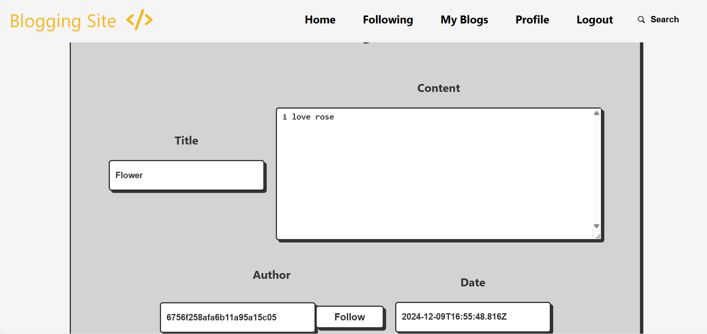
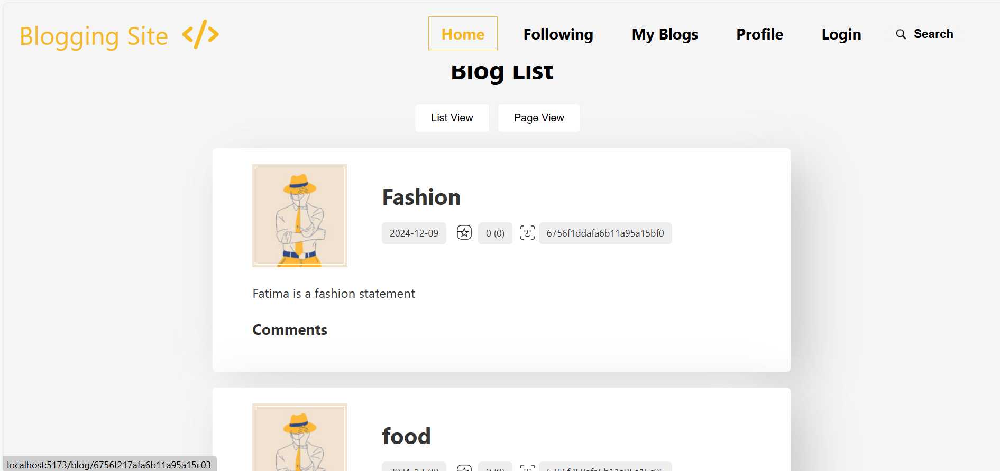
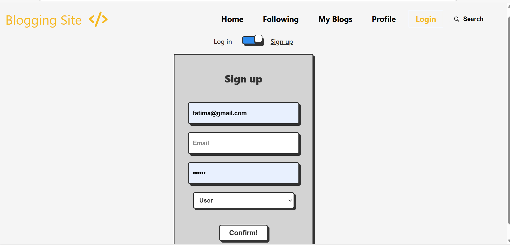
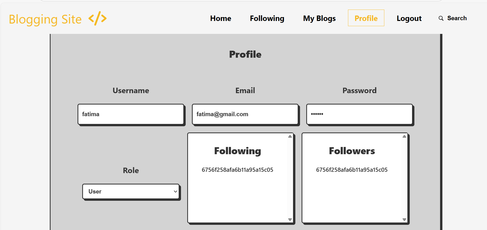
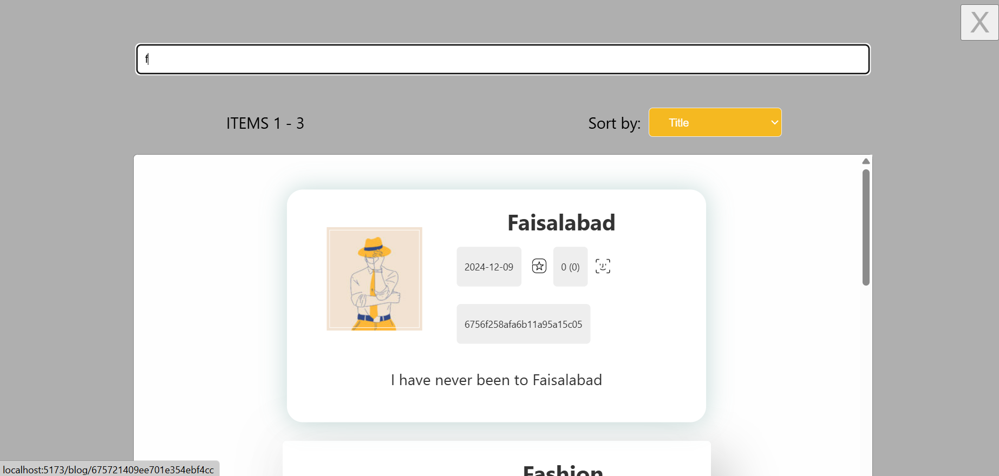
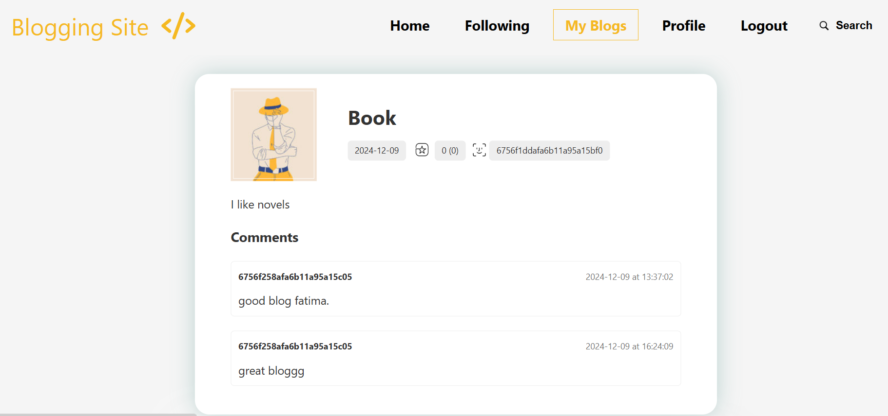

---

# Software Quality Testing Project

## Project Overview
This project focuses on testing a **Blogging Site** MERN Application developed by a Fellow Developer. I tested critical features such as **Blog Follow**, **Login**, and **Search** functionalities using **Cypress** for automated testing. And the backend was tested through Postman and Manual testing

### Attached UI Screenshot
Below is the screenshot of the UI under test:







---

## Requirements Fulfilled

1. **Test Plan**  
   Developed a test plan following the IEEE 829 standard, which includes:
   - **Test Plan Identifier**  
   - **Introduction**  
   - **Test Items**  
   - **Features to Be Tested**  
   - **Features Not to Be Tested**  
   - **Test Approach**  
   - **Pass/Fail Criteria**  
   - **Testing Deliverables**  
   - **Testing Environment**  
   - **Roles and Responsibilities**  
   - **Risks and Contingencies**  

2. **Test Cases**  
   Created detailed test cases for both **White-Box Testing** and **Black-Box Testing**:  
   - **White-Box Testing**:
     - Statement Coverage  
     - Decision Coverage  
   - **Black-Box Testing**:
     - Equivalence Partitioning  
     - Boundary Value Analysis  

   ### Test Case Format  
   Each test case includes:  
   - Test Case ID  
   - Objective  
   - Pre-conditions  
   - Steps to Execute  
   - Expected Results  
   - Actual Results  
   - Status (Pass/Fail)  

3. **Defect Reports**  
   Used a defect-tracking tool such as Jira was used to log defects. Each defect report includes:  
   - Defect ID  
   - Summary  
   - Steps to Reproduce  
   - Expected and Actual Results  
   - Severity and Priority  
   - Status (New, Open, Fixed, etc.)

4. **Automation Scripts**  
   Automated three key test cases using **Cypress**. Scripts are well-documented with comments explaining the logic.

5. **Static Analysis Review**  
   Conducted a static analysis review of the project codebase using **ESLint**. Documented identified issues and provided recommendations for improvements.

---

## Tools Used  
- **Cypress** for frontend test automation  
- **Jira** for defect tracking  
- **ESLint** for static analysis  

---

## Key Features Tested  
- **Login Functionality**  
- **Follow Feature**
- **Profile Feature**
- **Logout Functionality**
- **My Blogs Feature**
- **My Follower's Feature**
  
---

## Steps to Run Automation Tests  
1. Install dependencies:  
   ```bash
   npm install
   ```
2. Run Cypress tests:  
   ```bash
   npx cypress open
   ```

3. Execute test scripts from the Cypress test runner.


## Conclusion  
This project demonstrates comprehensive testing using both manual and automated techniques, ensuring the quality of critical features in the blogging site.

---
